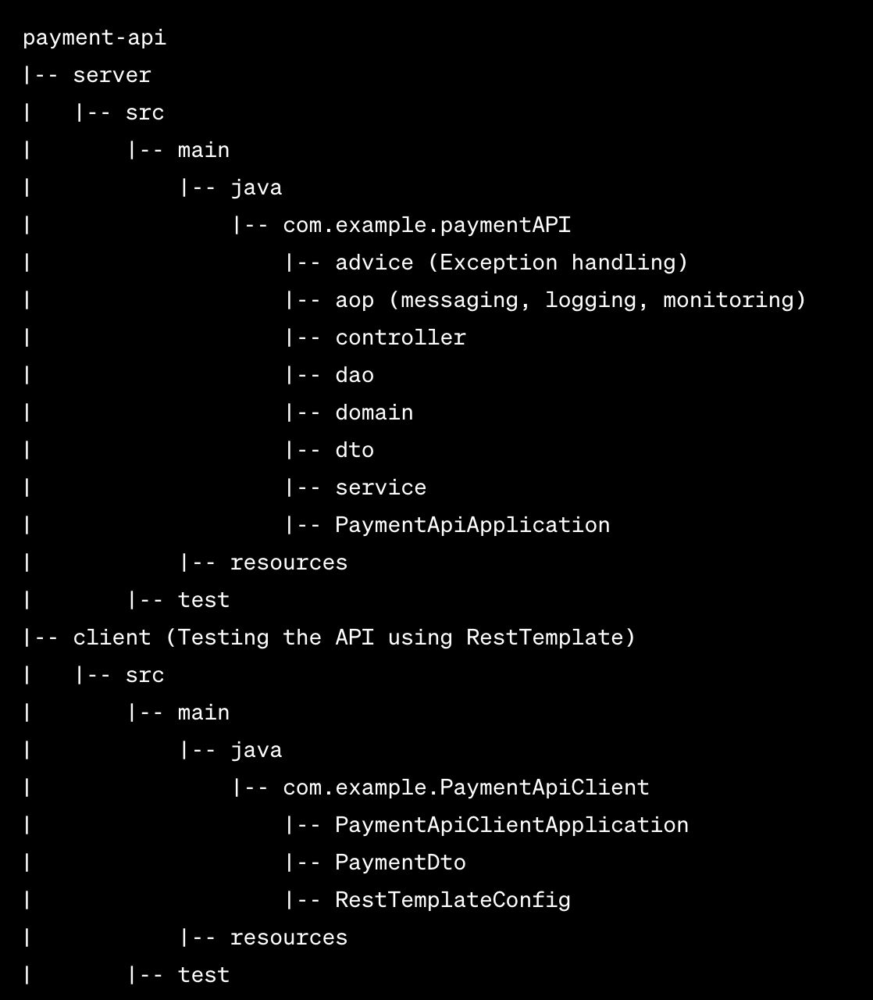

# payment-api
Development of  REST service to create a payment, send a notification to customer, and show the state of the payment. The API should be able to accept a Return for the Payment as well and match it to the original payment. This project includes  logging and monitoring features.

# Payment Service

The Payment Service is a Spring Boot application providing RESTful endpoints for creating payments, processing returns, and checking payment status. The service uses an in-memory H2 database for simplicity.

## Table of Contents

- [Getting Started](#getting-started)
  - [Prerequisites](#prerequisites)
  - [Installation](#installation)
- [Usage](#usage)
  - [Endpoints](#endpoints)
- [Project Structure](#project-structure)
- [Dependencies](#dependencies)
- [Configuration](#configuration)
- [Logging](#logging)
- [Monitoring](#monitoring)
- [Testing](#testing)


## Getting Started

### Prerequisites

- Java 8 or later
- Spring boot 3.0 or later
- Maven (for building and managing dependencies)

### Installation

 1. Clone the repository by using this command:
    ```bash
    git clone https://github.com/aboukham/payment-api
    ```

 2. Navigate to the project directory by using this commands:
   ```bash
    cd payment-api
    cd server
   ```
    Then open this diroctory in your IDE
 3. Run the application by clicking the run icon on your IDE or use this command:
    ```bash
    java -jar target/payment-api.jar
    ```

 ## Usage

 ### Endpoints
 
 1. `POST /api/payment/create?email={customerEmail}, PAYLOAD={"id":1, "amount": 100.0}`: Create a payment and send a notification to the customer.

 2. `PUT /api/payment/return?email={customerEmail}, PAYLOAD={"id":1, "amount": 100.0}`: Return a payment and send notification to the customer.

 3. `GET /api/payment/{id}`: Get the payment status.

    
## Project Structure



## Dependencies

Spring Web
Spring JPA
LomboK
H2 Database
Spring Boot Actuator
Java Mail

## Configuration

Connect to h2 database: check the application.properties file inside ressources folder to get all the information needed to connect to the User Interface of H2 database.

## Logging and Monitoring

Used Spring actuator, ObservationHandeler and Observation Registry to log the execution time of each method in the service. Allowing all actuator endpoints in application.properties file provides all the information about the service.

## Testing
For testing you can use postman and send the above endpoints woth your input or open the client folder on IDE and run it, you will see the result of some test cases provided in this service to test all features.

